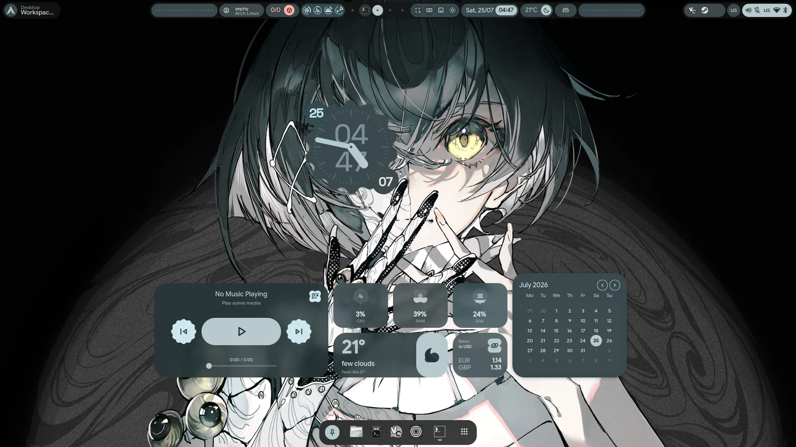
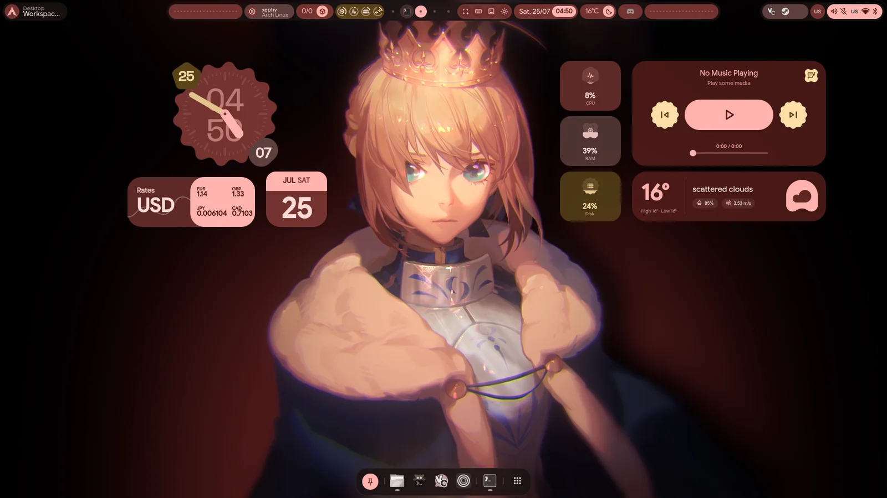
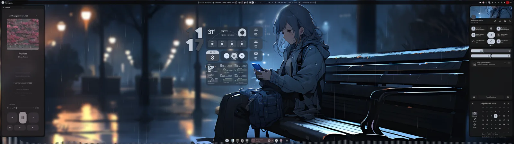
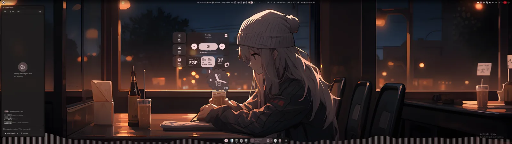

<div align="center">
    
    <h1>【 Immaterial Impulse 】</h1>
    <h3>The evil twin of <a href="https://github.com/end-4/dots-hyprland">illogical-impulse</a>.</h3>
    <p><em>illogical-impulse asks "do you really need this?" — Immaterial Impulse asks "but do you <b>want</b> it?"</em></p>
    <p>English | <a href="README.zh-CN.md">简体中文</a> | <a href="README.ja.md">日本語</a></p>
</div>

<div align="center">
  <table>
    <tr>
      <td width="50%"></td>
      <td width="50%"></td>
    </tr>
    <tr>
      <td width="50%"></td>
      <td width="50%"></td>
    </tr>
  </table>
  <p><em>Same shell, four wallpapers — Material You retints the whole desktop to each.</em></p>
</div>

---

## The premise

[illogical-impulse](https://github.com/end-4/dots-hyprland) is utility-first: a
disciplined, beautiful, minimal Material 3 shell that earns every widget.

**Immaterial Impulse takes that same gorgeous base and does the opposite.** It
leans all the way into the stuff a utility-first shell calls bloat — live
Wallpaper Engine backgrounds, a full plugin platform, docker controls, Discord
voice, a periodic-table cheatsheet — and ships it as a single, plug-and-play
suite. Same DNA. Zero restraint. On purpose.

It **began** as a fork of illogical-impulse by [@end-4](https://github.com/end-4),
rebranded and unified into one repo: the [Quickshell](https://quickshell.outfoxxed.me/)
shell, the full [Hyprland](https://github.com/hyprwm/hyprland) config, and a
guided installer, together. It no longer tracks its ancestors — this is an
independent project, and "fork" now describes only where it started. It
**supersedes** an illogical-impulse install — first launch migrates your old
config and secrets over, losing nothing.

> **What it is:** the graphical shell + Hyprland config + installer.
> **What it isn't:** a full system bootstrapper — no drivers, no zram, no bootloader.

---

## The bloat, lovingly curated

### 🧩 A real plugin platform
The headline. Not a config file — an extensible widget platform. Drop a plugin
into `~/.config/immaterial-impulse/plugins/` and it shows up. Two formats:
**declarative** plugins that describe approved components in a `manifest.json`,
and **package** plugins that ship their own QML using native shell components
and tokens. Entry points cover **bar widgets, desktop widgets, control-center
widgets, launcher providers, whole panels, and settings UIs**, behind a
declared **permissions** model (`process`, `network`, `filesystem`, `settings`).
There's a plugin **catalog** with author attribution, **remote install**, and a
design-system library (`ExpressiveTokens`, a component registry) for authors.
Fifteen bundled: clock, calendar, weather, media, visualizer, currency, system
and GPU monitors, notes, world clock, custom image, user card, **Docker**
controls, **Discord voice**, image converter.

### 🖥️ A desktop you lay out yourself
**Edit Mode** places, resizes and snaps widgets on the desktop, with undo and
redo, a drawer to park them in, and arrow-key nudging. The **lock screen has
its own layout** — pick which widgets it shows and where. Bar **styles** to
switch live (Float Islands among them), quick toggles in **pages**, a weather
popup with an hourly forecast, and popups that mark on the bar where they came
from.

### 🌊 Live wallpapers, not just images
A browser for **local** and **online** wallpapers — plus first-class
**Wallpaper Engine**: Steam Workshop scenes and videos render live inside the
shell through [qs-wallpaperengine](https://github.com/XephyLon/qs-wallpaperengine),
with **shader transitions** when you switch, a **per-wallpaper sidebar**
(frame rate, scaling, quality, audio, mouse, particles, the wallpaper's own
properties), a **Fill crop picker** on the real scene, **clock depth** on a live
scene, and a **compatibility scan** that finds the wallpapers your renderer
cannot run. The **frost** control decides how widgets sit over the wallpaper:
a true in-shell **blur** of the region behind, or a cheap palette **tint**.

### 🎨 Material You, everywhere at once
Pick a wallpaper; the whole system re-colors, and the shell **fades** to the
new palette. matugen propagates it to GTK, Qt, Hyprland, your terminal,
**cava**, **tmux**, and the shell itself. Light and dark, scheme variants, an
accent override when you want one.

### 🎵 Media with synced lyrics
**Word-level** karaoke where a source has it, line sync elsewhere; a media
widget whose two faces morph into each other; cover art from the player.

### 🤖 Intelligence, and a phone
Chat with any **OpenAI-compatible** endpoint, **Anthropic**, **Gemini**,
**Mistral**, OpenRouter's catalogue, or local **Ollama** from the sidebar —
drafts that survive, chats that save themselves, personas, tools. Pair an
**Android phone** over Wi-Fi: mirrored **notifications**, **contacts**, and its
**screen, camera and microphone** on the desktop.

### 🧰 Quality-of-life
An **overview** with live window previews, **notifications** and a to-do list,
**OSD** and a full-size **on-screen keyboard**, a **region selector** with a
toolbar for screenshots, recording, OCR and Google Lens, on-screen
**translation**, an **OLED screensaver**, **presets** you can apply
selectively, anti-flashbang, and — yes — a keyboard-shortcut **cheatsheet**
with a periodic table and a **typing test** on `Super`+`/`, because why not.

---

## Compositor support

**Hyprland only.** There are no plans to support Niri or any other
compositor — I don't use anything else and have no plans to start.
Compositor-abstraction code arriving from upstream is reduced to a thin
Hyprland-only facade; PRs porting the shell to other compositors will not
be accepted.

## Installation

> Installs the shell to `~/.config/quickshell/imi` and its config to
> `~/.config/immaterial-impulse`. **Coming from illogical-impulse?** The installer
> detects a prior install — either by its `illogical-impulse-*` packages or a
> leftover `~/.config/illogical-impulse` config (manual installs) — and transitions
> it: the `immaterial-impulse-*` packages replace the old ones, your
> `~/.config/quickshell` is backed up before overwrite, and the config dir +
> keyring entries migrate to the new names on first launch.

```sh
# Quick install — fetches the suite, then runs the installer (bash/zsh/fish)
curl -fsSL https://raw.githubusercontent.com/XephyLon/immaterial-impulse/main/get.sh -o /tmp/imi-get.sh && bash /tmp/imi-get.sh

# Or clone and run it yourself
git clone https://github.com/XephyLon/immaterial-impulse.git
cd immaterial-impulse
./setup
```

> Download-then-run keeps things portable and correct: `curl … | bash` would
> occupy stdin and break the installer's interactive menu, and `bash <(curl …)`
> is bash-only (fails in fish). If you're in bash and prefer a one-liner,
> `bash <(curl -fsSL …/get.sh)` also works.

`./setup` with no arguments opens a **whiptail menu** to pick:

- **Components** — core config and dependencies.
- **Wallpaper Engine** (optional) — puts a custom Quickshell carrying the
  Wallpaper Engine module ahead of the stock binary on `PATH`. On x86_64 it
  installs a **verified prebuilt** (checksum-checked) in seconds; if none matches
  (other arch, older Qt, checksum/smoke failure) it falls back to compiling from
  source. The long compile is cancellable (Ctrl-C). Off by default; WE
  wallpapers degrade to static otherwise.
- **SDDM login theme** (optional, Arch only) — installs
  [imi-sddm-theme](https://github.com/XephyLon/imi-sddm-theme) via its own installer,
  matching the lock-screen aesthetic on the login screen. Off by default.
- **Extras** — fontset, fcitx5 IME, and other situational overlays.

Every command prints before it runs. For scripting, `./setup install` runs the
same pipeline non-interactively.

**Updating:** Settings > About > **Update Dots**, or run the installer again; it
is idempotent, and the About page shows what changed. An update replaces the
shell and the shipped Hyprland config (`~/.config/hypr/hyprland/`) and leaves
your own files alone: `~/.config/hypr/custom/` (your Hyprland overrides),
`~/.config/immaterial-impulse/` (settings), and the shell-generated
`hyprland/shellOverrides/`. `hyprlock.conf` and `hypridle.conf` are kept, with
the new version placed beside them as `.new`.

**Moving machines:** `./setup backup` archives exactly those files of yours
into `~/imi-backup-<date>.tar.gz`; `./setup restore <archive>` puts them back
on a fresh install, moving anything already there aside as `.pre-restore-*`.

**Keybinds** follow Windows/GNOME muscle memory:

| Keybind | Action |
| --- | --- |
| `Super`+`/` | Full keybind cheatsheet |
| `Super`+`Enter` | Terminal |

---

## Software overview

| Software | Purpose |
| --- | --- |
| [Hyprland](https://github.com/hyprwm/hyprland) | Wayland compositor — manages and renders windows |
| [Quickshell](https://quickshell.outfoxxed.me/) | QtQuick widget system — bar, sidebars, dock, plugins, the lot |
| matugen | Material You color generation from the wallpaper |
| Others | See [deps-info.md](../sdata/deps-info.md) |

---

## Screenshots

### Edit Mode, on the lock screen

The lock screen has its own widget layout, edited in place.


### Wallpaper Engine

The selector over a live scene, and the palette that follows it.


### Intelligence



### Switch bar styles on the fly

One keybind swaps the whole bar layout live — no restart, no config editing.


---

## Credits

The good twin and the community it came from:

- [@end-4](https://github.com/end-4) — illogical-impulse, the root this grew
  out of.
- [pctrade](https://github.com/pctrade/end4-pC) — the `end4-pC` fork this suite
  branched from.
- [na-ive](https://github.com/na-ive/nandoroid-shell) — nandoroid-shell, source
  of the bundled Nandoroid widget plugins and expressive design tokens (AGPL-3.0).
- [caelestia-dots](https://github.com/caelestia-dots/caelestia) — the "Caelestia"
  animation preset.
- [@clsty](https://github.com/clsty) — the original install script and much more.
- [@midn8hustlr](https://github.com/midn8hustlr) — the color generation system.
- [@outfoxxed](https://github.com/outfoxxed/) — Quickshell.
- Quickshell dotfiles: [Soramane](https://github.com/caelestia-dots/shell/),
  [FridayFaerie](https://github.com/FridayFaerie/quickshell),
  [nydragon](https://github.com/nydragon/nysh).

## License

See the repository license. Copy and adapt freely — just follow the terms.
