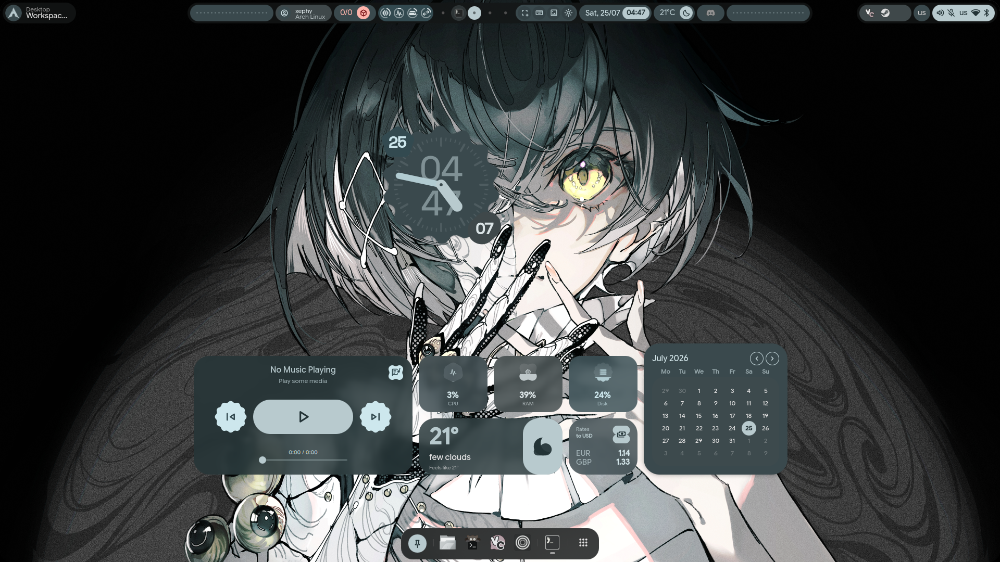
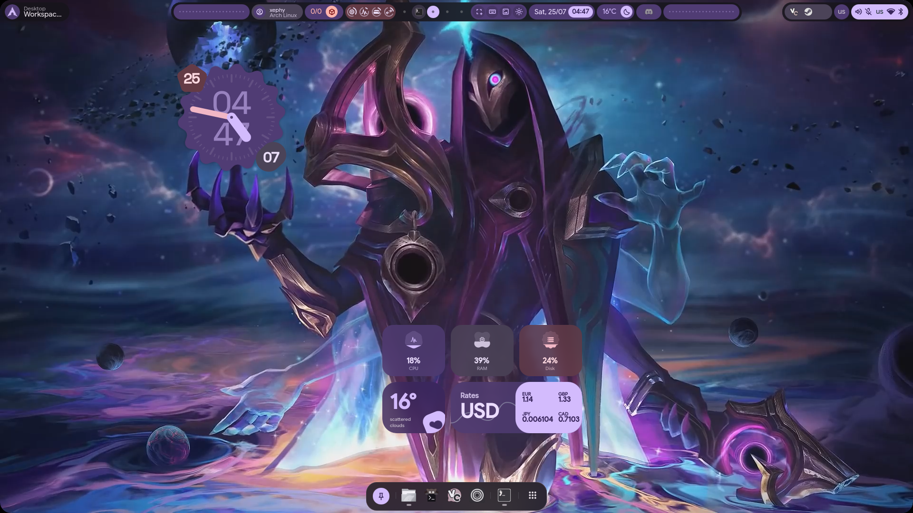
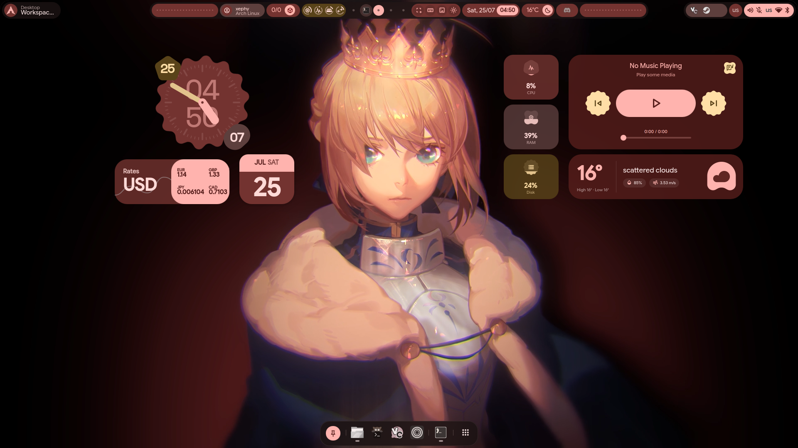
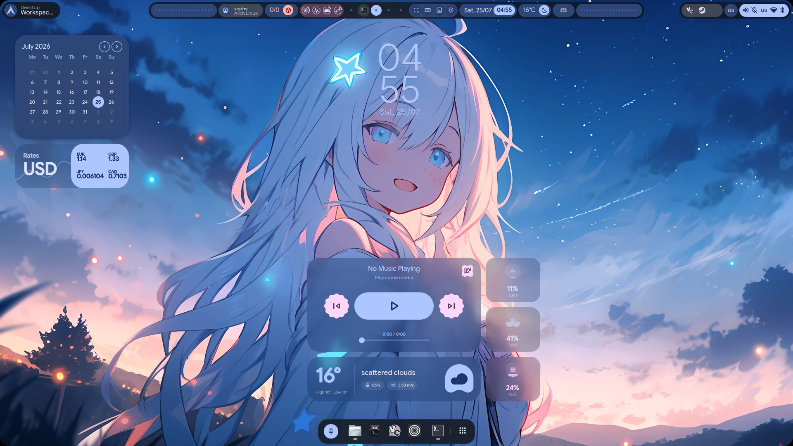
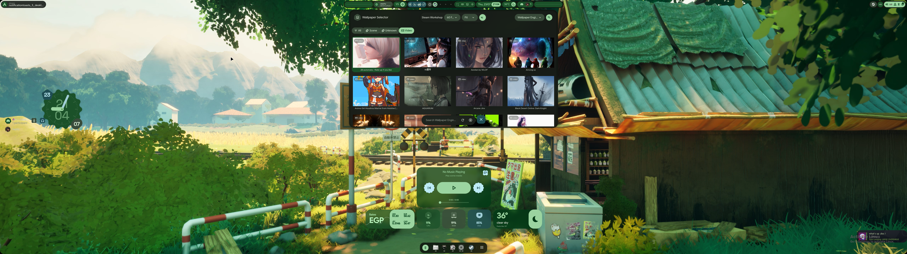
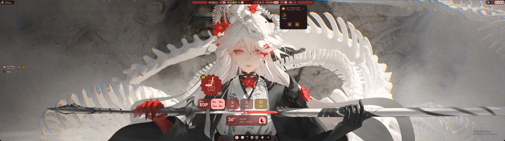
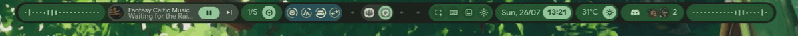

<div align="center">
    
    <h1>【 Immaterial Impulse 】</h1>
    <h3><a href="https://github.com/end-4/dots-hyprland">illogical-impulse</a> 的邪恶双子。</h3>
    <p><em>illogical-impulse 会问「你真的需要这个吗？」—— Immaterial Impulse 会问「但你<b>想要</b>它吗？」</em></p>
    <p><a href="README.md">English</a> | 简体中文 | <a href="README.ja.md">日本語</a></p>
</div>

<div align="center">
  <table>
    <tr>
      <td width="50%"></td>
      <td width="50%"></td>
    </tr>
    <tr>
      <td width="50%"></td>
      <td width="50%"></td>
    </tr>
  </table>
  <p><em>同一套 Shell，四张壁纸 —— Material You 会根据每张壁纸为整个桌面重新配色。</em></p>
</div>

---

## 缘起

[illogical-impulse](https://github.com/end-4/dots-hyprland) 以实用为先：一个克制、
精美、极简的 Material 3 桌面 shell，每个部件都必须证明自己的价值。

**Immaterial Impulse 继承了同样华丽的底子，却反其道而行之。** 它把实用主义
shell 眼中的「臃肿」全盘拥抱——Wallpaper Engine 动态壁纸、完整的插件平台、
Docker 控制、Discord 语音、元素周期表速查表——并打包成一个即插即用的完整套件。
同样的基因，零克制，全是故意的。

它**起初**是 [@end-4](https://github.com/end-4) 的 illogical-impulse 的分支，
重新命名并统一进一个仓库：[Quickshell](https://quickshell.outfoxxed.me/)
shell、完整的 [Hyprland](https://github.com/hyprwm/hyprland) 配置，以及一个
向导式安装器，三合一。它已不再跟随上游——这是一个独立项目，「分支」如今
只描述它的起点。它会**取代**已有的 illogical-impulse 安装——首次启动时迁移
你的旧配置和密钥，什么都不会丢。

> **它是什么：** 图形 shell + Hyprland 配置 + 安装器。
> **它不是什么：** 完整的系统引导器——不装驱动、不配 zram、不碰引导加载器。

---

## 精心呵护的「臃肿」

### 🧩 货真价实的插件平台
头号卖点。这不是一份配置文件，而是一个可扩展的部件平台。把插件丢进
`~/.config/immaterial-impulse/plugins/`，它就会出现。两种格式：
**声明式**插件通过 `manifest.json` 描述已批准的组件；**包**插件自带 QML，
可使用原生 shell 组件和设计令牌。入口涵盖**状态栏部件、桌面部件、控制中心
部件、启动器提供方、整块面板和设置界面**，并受声明式**权限**模型约束
（`process`、`network`、`filesystem`、`settings`）。还有带作者署名的插件
**目录**、**远程安装**，以及面向插件作者的设计系统库（`ExpressiveTokens`、
组件注册表）。内置示例：**Docker** 控制、**Discord 语音**、系统监视器、
天气、汇率和时钟部件。

### 🌊 动态壁纸，而不只是图片
一个浏览**本地**和**在线**壁纸的浏览器——外加一等公民级的
**Wallpaper Engine** 支持：WE 动画场景直接在 shell 内实时渲染，切换时带
**着色器过渡**。**frost（磨砂）**控制决定部件如何浮在壁纸上：对身后区域做
真正的 shell 内**模糊**，或者廉价的调色板**染色**。

### 🎨 Material You，处处同步
选一张壁纸，整个系统随之换色。matugen 把同一套调色板传播到 GTK、Hyprland、
终端、**cava**、**tmux**，以及 shell 本身。

### 🖥️ 一整个桌面，而不只是一根栏
全程 Material 3 Expressive：水平或垂直**状态栏**、**程序坞**、左右**侧边栏**、
带实时窗口预览的**总览**、**通知**、**OSD** 和**屏幕键盘**、**带同步歌词的
媒体控制**、**会话/锁定**界面、**polkit** 代理，以及一个把这一切都管起来的
shell 内**设置应用**——还附带一键 Hyprland 动画预设。

### 🤖 AI + 生活质量
在侧边栏与任意 OpenAI 兼容端点、Gemini 或本地 Ollama 对话。屏幕**翻译**、
用于截图和 Google Lens 的**区域选择器**、防闪光弹（anti-flashbang），
还有——没错——按 `Super`+`/` 弹出的快捷键**速查表**，里面带元素周期表，
为什么不呢。

---

## 合成器支持

**仅支持 Hyprland。** 没有支持 Niri 或任何其他合成器的计划——我不使用别的合成器，也不打算使用。来自上游的合成器抽象代码会被精简为仅面向 Hyprland 的轻量门面；将本 shell 移植到其他合成器的 PR 恕不接受。

## 安装

> 将 shell 安装到 `~/.config/quickshell/imi`，其配置安装到
> `~/.config/immaterial-impulse`。**从 illogical-impulse 迁移？** 安装器会检测
> 先前的安装——通过其 `illogical-impulse-*` 软件包或残留的
> `~/.config/illogical-impulse` 配置（手动安装的情况）——并完成过渡：
> `immaterial-impulse-*` 软件包替换旧包，覆盖前会备份你的
> `~/.config/quickshell`，配置目录和密钥环条目会在首次启动时迁移到新名称。

```sh
# Quick install — fetches the suite, then runs the installer (bash/zsh/fish)
curl -fsSL https://raw.githubusercontent.com/XephyLon/immaterial-impulse/main/get.sh -o /tmp/imi-get.sh && bash /tmp/imi-get.sh

# Or clone and run it yourself
git clone https://github.com/XephyLon/immaterial-impulse.git
cd immaterial-impulse
./setup
```

> 先下载再运行，既可移植又正确：`curl … | bash` 会占用 stdin、破坏安装器的
> 交互菜单，而 `bash <(curl …)` 只有 bash 能用（在 fish 中会失败）。如果你
> 就在 bash 里、偏爱一行命令，`bash <(curl -fsSL …/get.sh)` 也可以。

不带参数运行 `./setup` 会打开一个 **whiptail 菜单**供选择：

- **Components（组件）** —— 核心配置与依赖。
- **Wallpaper Engine**（可选）—— 将携带 Wallpaper Engine 模块的定制
  Quickshell 置于 `PATH` 上原版二进制之前。在 x86_64 上会在数秒内安装
  **经校验的预构建版本**（校验和检查）；若无匹配（其他架构、较旧的 Qt、
  校验和/冒烟测试失败）则回退到从源码编译。漫长的编译可随时取消（Ctrl-C）。
  默认关闭；不装的话 WE 壁纸会退化为静态图片。
- **SDDM 登录主题**（可选，仅 Arch）—— 通过其自带安装器安装
  [ii-sddm-theme](https://github.com/3d3f/ii-sddm-theme)，让登录界面与锁屏
  美学保持一致。默认关闭。
- **Extras（附加项）** —— 字体集、fcitx5 输入法及其他按需覆盖项。

每条命令在执行前都会打印出来。若用于脚本，`./setup install` 以非交互方式
运行同一流水线。

**快捷键**沿用 Windows/GNOME 的肌肉记忆：

| 快捷键 | 动作 |
| --- | --- |
| `Super`+`/` | 完整快捷键速查表 |
| `Super`+`Enter` | 终端 |

---

## 软件一览

| 软件 | 用途 |
| --- | --- |
| [Hyprland](https://github.com/hyprwm/hyprland) | Wayland 合成器——管理并渲染窗口 |
| [Quickshell](https://quickshell.outfoxxed.me/) | QtQuick 部件系统——状态栏、侧边栏、程序坞、插件，全都归它 |
| matugen | 从壁纸生成 Material You 配色 |
| 其他 | 见 [deps-info.md](../sdata/deps-info.md) |

---

## 截图

### 同一底子，任意心情

同一个 shell，三套调色板——Material You 从壁纸出发为一切重新上色。

<table>
  <tr><td colspan="2" align="center"><br><em>Green</em></td></tr>
  <tr><td colspan="2" align="center"><br><em>Study</em></td></tr>
  <tr><td colspan="2" align="center"><br><em>Red</em></td></tr>
</table>

### 一键切换栏样式

一个快捷键即可实时切换整个栏布局 —— 无需重启，也无需修改配置。



---

## 致谢

善良的那位双子，以及它所来自的社区：

- [@end-4](https://github.com/end-4) —— illogical-impulse，本项目生长的根。
- [pctrade](https://github.com/pctrade/end4-pC) —— 本套件当初分出来的
  `end4-pC` 分支。
- [na-ive](https://github.com/na-ive/nandoroid-shell) —— nandoroid-shell，
  内置 Nandoroid 部件插件与 expressive 设计令牌的来源（AGPL-3.0）。
- [caelestia-dots](https://github.com/caelestia-dots/caelestia) ——「Caelestia」
  动画预设。
- [@clsty](https://github.com/clsty) —— 最初的安装脚本及更多贡献。
- [@midn8hustlr](https://github.com/midn8hustlr) —— 颜色生成系统。
- [@outfoxxed](https://github.com/outfoxxed/) —— Quickshell。
- Quickshell 配置参考：[Soramane](https://github.com/caelestia-dots/shell/)、
  [FridayFaerie](https://github.com/FridayFaerie/quickshell)、
  [nydragon](https://github.com/nydragon/nysh)。

## 许可证

见仓库许可证。欢迎复制与改编——遵守条款即可。
