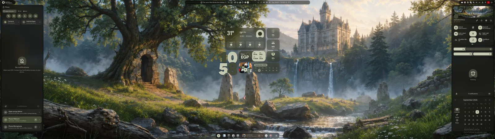
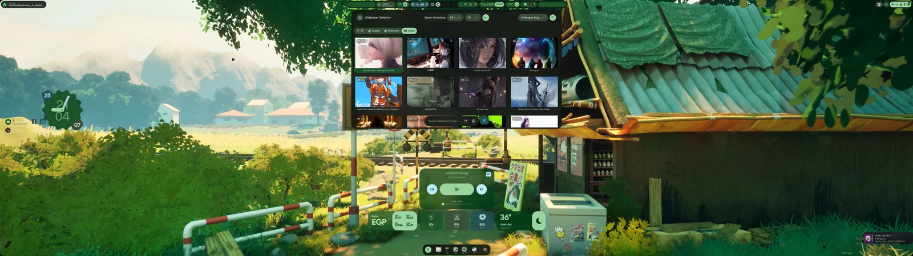
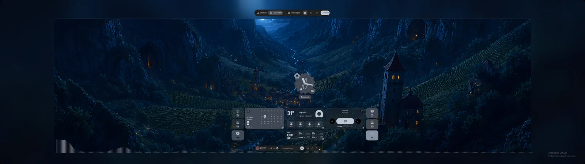

# Immaterial Impulse

A Material 3 Expressive desktop for **Hyprland**, built on [Quickshell](https://quickshell.org):
the shell, the compositor config, a plugin platform and the installer, in one tree.
The whole desktop takes its colours from the wallpaper and moves like one thing.



## What you get

- **Wallpaper-driven theming.** matugen generates a Material 3 palette from the wallpaper and
  applies it to the shell, GTK, Qt, kitty and the rest; the shell itself fades to the new colours.
  Light and dark, scheme variants, an accent override when you want one.
- **Wallpaper Engine, embedded.** Steam Workshop scenes and videos render inside the shell
  through [qs-wallpaperengine](https://github.com/XephyLon/qs-wallpaperengine): per-wallpaper
  settings, a Fill crop picker, a quality dial, clock depth on a live scene, and a compatibility
  scan that finds the wallpapers your renderer cannot run.
- **A desktop you lay out yourself.** Edit Mode places, resizes and snaps widgets on the desktop
  and, separately, on the lock screen, with undo and redo. Fifteen bundled widgets: clock,
  calendar, weather, media, visualizer, currency, system and GPU monitors, notes, world clock,
  custom image, user card, Docker, Discord voice, image converter.
- **A bar with styles**, Float Islands among them, quick toggles in pages, a weather popup with an
  hourly forecast, a privacy pill that acts, and popups that mark where they came from.
- **Media with synced lyrics.** Word-level karaoke where a source has it, line sync elsewhere,
  morphing media widget, cover art from the player.
- **Intelligence.** A sidebar for chat models over any OpenAI-compatible or native provider,
  with drafts that survive, saved chats, personas and tools.
- **Phone.** Pair an Android phone over Wi-Fi: mirrored notifications, contacts, screen, camera
  and microphone on the desktop.
- **The rest of a desktop.** Launcher with modes, region capture and recording with a toolbar,
  on-screen keyboard, notifications and a to-do list, an OLED screensaver, presets you can apply
  selectively, a typing test in the cheatsheet.

## A look

| | |
|---|---|
|  |  |
| Wallpaper Engine, and the palette that follows it. | The lock screen has its own layout. |
|  |  |
| Synced lyrics in the media sidebar. | The Intelligence sidebar. |

## Install

Arch, Fedora and Gentoo have dependency scripts; NixOS has a flake (below).

```sh
curl -fsSL https://raw.githubusercontent.com/XephyLon/immaterial-impulse/main/get.sh -o /tmp/imi-get.sh && bash /tmp/imi-get.sh
```

The installer walks you through the optional components: the Wallpaper Engine renderer, the
imi-sddm-theme login theme, and a Plymouth boot splash. From a checkout, `./setup install` is
the same thing; `./setup --help` lists the rest.

### Update

Settings > About > **Update Dots**, or run the installer again; it is idempotent. The About
page shows what changed. An update replaces the shell and the shipped Hyprland config
(`~/.config/hypr/hyprland/`), and leaves your own files alone: `~/.config/hypr/custom/`
(your Hyprland overrides), `~/.config/immaterial-impulse/` (settings), and the shell-generated
`hyprland/shellOverrides/`. `hyprlock.conf` and `hypridle.conf` are kept, with the new version
placed beside them as `.new`.

### NixOS (experimental)

The repository root is a Nix flake. Instead of the installer, a home-manager user adds:

```nix
inputs.immaterial-impulse.url = "github:XephyLon/immaterial-impulse";
```

and imports `inputs.immaterial-impulse.homeManagerModules.default` with
`programs.immaterial-impulse.enable = true`. The module symlinks the shell tree and the matugen
config from the store, seeds `~/.config/immaterial-impulse` once, and refuses to manage matugen's
generated outputs. Wallpaper-driven colour generation and the Wallpaper Engine integration do not
work on it yet; see [docs/proposals/nixos-flake.md](docs/proposals/nixos-flake.md).

## Compositor support

**Hyprland only.** There are no plans to support Niri or any other compositor.

## Documentation

- [CHANGELOG.md](CHANGELOG.md) - what shipped in each release (also shown in the About page).
- [docs/PLUGINS.md](docs/PLUGINS.md) - writing widgets, panels and services; [docs/PLUGIN_STORE.md](docs/PLUGIN_STORE.md) - publishing them.
- [docs/PLUGIN_DESIGN_SYSTEM.md](docs/PLUGIN_DESIGN_SYSTEM.md) and [docs/M3_GUIDELINES.md](docs/M3_GUIDELINES.md) - the design language.
- [docs/tests-README.md](docs/tests-README.md) - the test suite and its harnesses.
- [CONTRIBUTING.md](CONTRIBUTING.md) - how changes land; [AGENT.md](AGENT.md) - the working notes an agent reads first.

## Credits

Descended from end-4's [illogical-impulse](https://github.com/end-4/dots-hyprland) by way of
[end4-pC](https://github.com/pctrade/end4-pC). Built on Quickshell, matugen and
linux-wallpaperengine. GPL-3.0.
